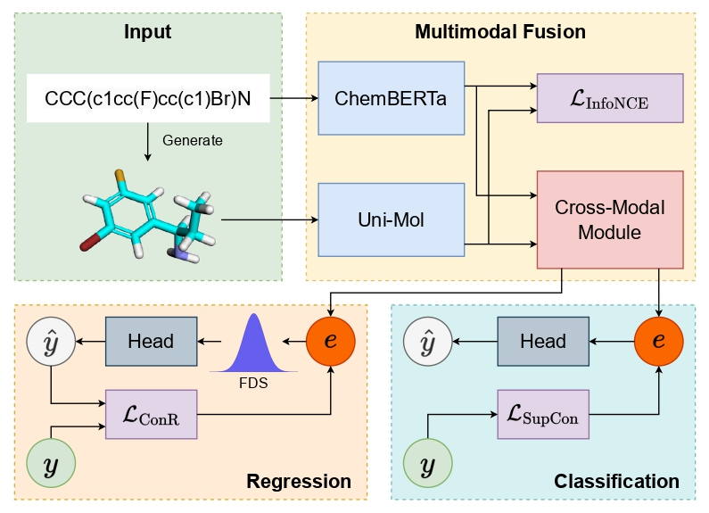

# From SMILES to Enhanced Molecular Property Prediction: A Unified Multimodal Framework with Predicted 3D Conformers and Contrastive Learning Techniques (JCIM 2024)

This repository contains the official implementation of **"From SMILES to Enhanced Molecular Property Prediction: A Unified Multimodal Framework with Predicted 3D Conformers and Contrastive Learning Techniques"**, published in *JCIM 2024*.



We introduce a novel molecular property prediction framework that takes **SMILES strings** as input and extends it to a multimodal approach by incorporating **predicted 3D conformer representations**. This allows the model to capture both the sequential character structure of SMILES and the three-dimensional spatial structure of molecules.

Key highlights of the framework:
- **Contrastive Learning**: Utilizes InfoNCE loss to align SMILES and conformer embeddings.
- **Task-Specific Losses**: Employs ConR for regression tasks and SupCon for classification tasks.
- **Feature Distribution Smoothing (FDS)**: Addresses data imbalance challenges commonly encountered in drug discovery.

## Requirements

- **Python 3.8.5**
- Install required dependencies:

   ```bash
   pip install -r requirements.txt
   ```

- **Uni-Core**: Install the Uni-Core library from [GitHub](https://github.com/dptech-corp/Uni-Core):

---

## Pretrained Models

The pretrained **Uni-Mol** and **ChemBERTa** models used in this framework are hosted on HuggingFace:

- Download them from [ndlong/mm-dti](https://huggingface.co/ndlong/mm-dti/tree/main).

Clone the model weights into the `weights` folder:
```bash
git clone https://huggingface.co/ndlong/mm-dti weights
```

---

## Dataset

We tested our framework on:
- **SARS-CoV-2 Drug Docking Score Prediction**
- **MoleculeNet Datasets** for molecular property prediction.
- **Custom Kinase Inhibitor Datasets** for JAK-1, JAK-2, and MAPK-14.

For access to refined datasets, please contact **[Dr. Binh Nguyen](mailto:binh.p.nguyen@vuw.ac.nz)**.

---

## Usage

To reproduce results from the paper, configure hyperparameters in `finetune.py` and run the training script:

```bash
## Start training
python finetune.py
```

---

## Acknowledgements

This repository builds upon the following projects:
- [Uni-Mol](https://github.com/deepmodeling/Uni-Mol)
- [ConR](https://github.com/BorealisAI/ConR)
- [imbalanced-regression](https://github.com/YyzHarry/imbalanced-regression)

We are grateful to the contributors of these projects for their valuable work!

---

## Citation

If you find this work useful in your research, please cite:

```bibtex
@article{doi:10.1021/acs.jcim.4c01240,
  author = {Nguyen, Long D. and Nguyen, Quang H. and Trinh, Quang H. and Nguyen, Binh P.},
  title = {From SMILES to Enhanced Molecular Property Prediction: A Unified Multimodal Framework with Predicted 3D Conformers and Contrastive Learning Techniques},
  journal = {Journal of Chemical Information and Modeling},
  doi = {10.1021/acs.jcim.4c01240},
  note ={PMID: 39641280},
  URL = {https://doi.org/10.1021/acs.jcim.4c01240}
}
```
